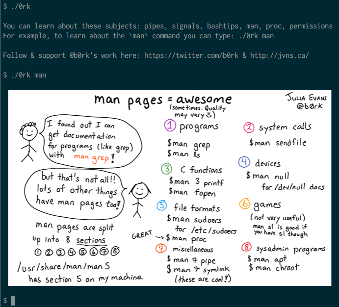

# 0rk

For details see: https://github.com/follower/0rk/blob/master/0rk

----

----

#### Potential options for implementing display-in-terminal feature

* Direct show in terminal appears to not be possible for Mac and Terminal.app combination.

* Mac + other terminal applications seem to be possible.

* Linux + xterm etc seems to be possible.

##### Sixel

 * <https://github.com/saitoha/libsixel>

 * <https://pypi.org/project/PySixel/>

 * <https://github.com/aki017/homebrew-sixel> -- "unmaintained"
 
 * "[sixcat: Like 'cat' but show images directly in the terminal using SIXEL graphics ](https://gist.github.com/hackerb9/a96cea91e6122d09a6c97f5eb797d5fa)" (mentions `convert foo.jpg sixel:-` from ImageMagick)
 
 * <https://github.com/saitoha/SDL1.2-SIXEL>
 
 * <https://github.com/dsanson/termpdf>

##### iTerm2 image support

 * <https://www.iterm2.com/documentation-images.html>
 
 * <https://www.iterm2.com/utilities/imgcat>
 
 * [`imgcat.py`](https://gist.github.com/garfieldnate/d48f3efd47234dd8ee28d2e674cf8bbe) -- gist port of `imgcat` to Python.
 
 * <https://github.com/asmeurer/iterm2-tools> / <https://pypi.org/project/iterm2-tools/>
 
 * <https://www.iterm2.com/documentation-escape-codes.html> -- more details (including character values) on how to use iTerm's proprietary escape codes.
 
 * "[Add function to determine if we are in iTerm2](https://github.com/asmeurer/iterm2-tools/issues/5)" -- (only really need this level of detail if ssh connection etc.)

##### Screen Overlay (Mac + Terminal.app)

 * See: [`FunkyOverlayWindow` sample code](https://developer.apple.com/library/content/samplecode/FunkyOverlayWindow/Introduction/Intro.html#//apple_ref/doc/uid/DTS10000391-Intro-DontLinkElementID_2)
 
 * "[Cocoa app Create transparent view on top of all mac running applications](https://stackoverflow.com/questions/16779469/cocoa-app-create-transparent-view-on-top-of-all-mac-running-applications)"

* Apps with overlay function that have source code to investigate:

  * [CThruView Transparent Image Viewer 1.0](http://cthruview.sourceforge.net/)
  
  * <https://github.com/yuhua-chen/LayerX>
  
  * <https://github.com/w0lfschild/afloat>
  
##### Other

 * <https://github.com/asciimoo/drawille/> -- "Pixel graphics in terminal with unicode braille characters"
 
 * <https://github.com/minikomi/ansipix>
 
